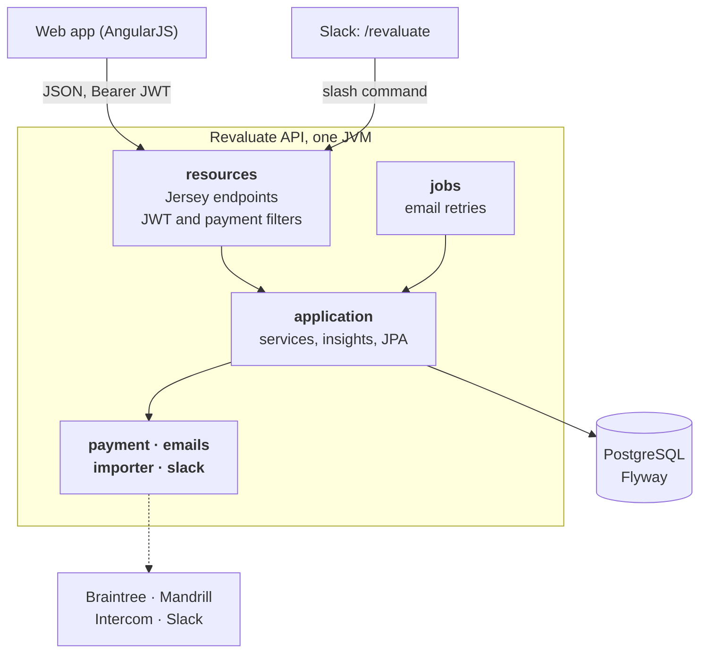
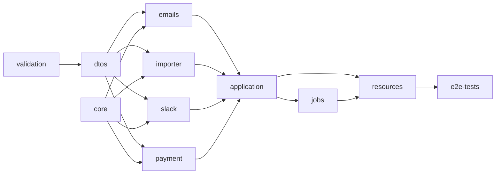
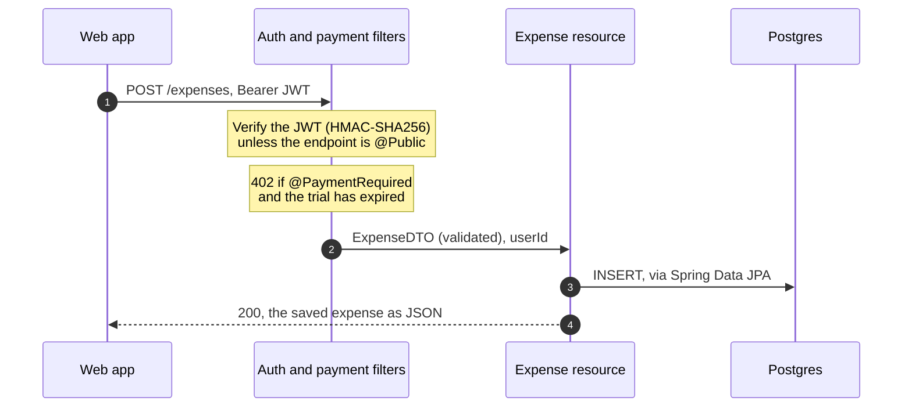

<div align="center">


# Revaluate API

**The backend of Revaluate, a personal expense tracker I built, launched in 2015 and ran in production for over a year.**

Expenses, categories, monthly goals and spending insights, with imports from Mint and Spendee, a Slack slash command and paid subscriptions.

[](https://github.com/ioanlucut/revaluate-api/actions/workflows/ci.yml)


[](https://www.producthunt.com/products/revaluate)
[](LICENSE)

**622** commits in 2015–16 · **16** releases · **70** endpoints · **223** tests · **37** schema migrations · **11** modules


</div>

_Revaluate_ helped people see where their money goes. You logged an expense in a couple of keystrokes, set goals such as _"spend less than 500 € on food in September"_, and got charts that compared months and categories. It launched in beta on **27 June 2015**, was [featured on Product Hunt](https://www.producthunt.com/products/revaluate) on **11 September 2015**, and was run by a team of two.

This repository is the whole backend: a REST API of 70 endpoints, in 11 Maven modules, over PostgreSQL. The web app it served is [`revaluate-web`](https://github.com/ioanlucut/revaluate-web).

## Features

1. **Expenses in a few keystrokes.**
   - Create, edit and bulk-delete expenses.
   - List them page by page, grouped by day, or filtered by a date range and category.
   - Amounts are stored in the user's currency, one of 75.
2. **Categories.** Each category has one of 15 colours. New users pick from a starter set in one bulk call, and names are checked for uniqueness.
3. **Goals.** A goal is a limit (_more_ or _less_ than an amount) for a category in a month. The API reports the progress of each goal against real spending.
4. **Insights.**
   - Monthly: the total per category, the biggest expense, and the category with the most transactions.
   - The difference from the previous month, in money and in percent.
   - Daily and month-by-month overviews.
   - Progress per category across months.
5. **Imports from other apps.**
   - Upload a CSV export from Mint, Spendee or Trace.
   - The API parses it and lists the categories it found.
   - The user maps each one to a Revaluate category, or skips it, and the import runs.
6. **Slack.** Connect your Slack team, then use `/revaluate add 43 FOOD going out`, `/revaluate list -cat FOOD -limit 5` or `/revaluate categories` from any channel.
7. **Accounts.**
   - Sign up with email and password (BCrypt), or with Facebook or Google.
   - Stateless JWT sessions.
   - Email confirmation, password reset and in-app feedback.
8. **Subscriptions.** Every account starts with a trial. Paying moves it to active through Braintree: a customer, a payment method and a subscription to the standard plan. Endpoints marked `@PaymentRequired` are blocked once the trial has expired.
9. **Operations.**
   - Transactional emails from Mandrill templates, with a scheduled job that retries failed sends.
   - Product events sent to Intercom.
   - Live stats for the team.
   - JavaMelody monitoring.

<table>
<tr>
<td width="33%"></td>
<td width="33%"></td>
<td width="33%"></td>
</tr>
<tr>
<td><sub>Insights compare categories across months.</sub></td>
<td><sub>Goals track a monthly limit per category.</sub></td>
<td><sub>Imports map another app's categories onto yours.</sub></td>
</tr>
</table>

<sub>Screenshots of the 2015 web app, from the Revaluate landing page.</sub>

## Architecture



It is a [Dropwizard](https://www.dropwizard.io) application wired with Spring, through [Fallwizard](https://github.com/Fallwizard/Fallwizard). Jersey serves the HTTP resources, and Spring Data JPA with Hibernate talks to Postgres. On startup, Flyway brings the schema up to date.

### Modules



| Module        | What it holds                                                                                                                                        |
| ------------- | ---------------------------------------------------------------------------------------------------------------------------------------------------- |
| `validation`  | Custom Bean Validation constraints, e.g. hex colours                                                                                                 |
| `dtos`        | The JSON contract: DTOs, JSON views and validation groups; builders are generated by PojoBuilder                                                     |
| `core`        | Configuration, JWT signing and verification, AOP logging, the `@Public` and `@PaymentRequired` annotations                                           |
| `emails`      | Mandrill templates for welcome, password reset and feedback emails                                                                                   |
| `importer`    | CSV parsing (uniVocity) and column profiles for Mint, Spendee and Trace                                                                              |
| `slack`       | The contract for answering Slack commands                                                                                                            |
| `payment`     | The Braintree gateway: customers, payment methods, subscriptions, transactions                                                                       |
| `application` | The domain: JPA entities and repositories, services, insights, Slack OAuth and the command parser (JCommander), Dozer mappings, 37 Flyway migrations |
| `jobs`        | A scheduled job that resends emails that failed to send                                                                                              |
| `resources`   | The Dropwizard application: Jersey resources, exception mappers, the auth and payment filters, CORS                                                  |
| `e2e-tests`   | End-to-end tests of the HTTP API against a running server                                                                                            |

### A request



## Quick start

You need Docker.

```bash
docker compose up --build
```

This builds the API with JDK 8, starts Postgres, runs the migrations and serves the API on **http://localhost:8080** (admin on `8081`). Then:

```bash
# Sign up, in euros
curl -s localhost:8080/account -H 'Content-Type: application/json' \
  -d '{"firstName":"Ada","lastName":"Lovelace","email":"ada@example.com","password":"correct-horse","currency":{"currencyCode":"EUR"}}'

# Log in: the JWT comes back in the AuthToken header
TOKEN=$(curl -s -D - -o /dev/null localhost:8080/account/login -H 'Content-Type: application/json' \
  -d '{"email":"ada@example.com","password":"correct-horse"}' | awk -F': ' 'tolower($1)=="authtoken"{print $2}' | tr -d '\r')

# A category, an expense, and the month's insights
curl -s localhost:8080/categories -H "Authorization: Bearer $TOKEN" -H 'Content-Type: application/json' \
  -d '{"name":"FOOD","color":{"id":1,"color":"#DD5440","colorName":"red","priority":1}}'
curl -s localhost:8080/expenses -H "Authorization: Bearer $TOKEN" -H 'Content-Type: application/json' \
  -d '{"value":23.5,"description":"Lunch","category":{"id":1,"name":"FOOD","color":{"id":1,"color":"#DD5440","colorName":"red","priority":1}},"spentDate":"2026-09-02T12:00:00.000"}'
curl -s "localhost:8080/insights/retrieve_from_to?from=2026-09-01T00:00:00Z&to=2026-10-01T00:00:00Z" -H "Authorization: Bearer $TOKEN"
```

### From source

You need JDK 8 and Maven.

```bash
docker compose up -d postgres                  # or any local Postgres with postgres/postgres
mvn install                                     # build and unit tests
java -DENVIRONMENT=local -jar resources/target/resources-1.0.jar server resources/src/main/resources/config_local.yaml
```

### Configuration

The `ENVIRONMENT` system property selects `core/src/main/resources/installation_<ENVIRONMENT>.properties`, and the YAML file configures Dropwizard. The `local` environment runs without any third-party account: emails are skipped, and the integration keys are empty.

To turn on an integration, pass its settings as system properties. They take precedence over the file:

| Integration | Properties                                                                                                                                             |
| ----------- | ------------------------------------------------------------------------------------------------------------------------------------------------------ |
| JWT         | `-Dshared=<long random secret>` `-Dissuer=<site URL>`                                                                                                  |
| Braintree   | `-DbraintreeMerchantId` `-DbraintreePublicKey` `-DbraintreePrivateKey` `-DbraintreePlanId`; sandbox unless `isProduction=true`                         |
| Slack       | `-DslackClientId` `-DslackClientSecret`                                                                                                                |
| Mandrill    | `-DmandrillAppKey` `-DskipSendEmail=false`                                                                                                             |
| Intercom    | `-DintercomAppId` `-DintercomAppKey`                                                                                                                   |
| JavaMelody  | `-DmonitoringUsers=user:password`; the `/monitoring` console is off without it                                                                         |
| Database    | `-Ddb.url` `-Ddb.username` `-Ddb.password` for Spring, and `-Ddw.database.url` `-Ddw.database.user` `-Ddw.database.password` for Dropwizard and Flyway |

## HTTP API

Everything except sign-up, login, the password-reset flow, OAuth and Slack needs `Authorization: Bearer <JWT>`. Dropwizard logs the full list of routes on startup.

| Resource                         | Endpoints                                                                                                        |
| -------------------------------- | ---------------------------------------------------------------------------------------------------------------- |
| `/account`                       | Sign up, login, OAuth connect, details, currency, password, email confirmation, password reset, feedback, delete |
| `/categories`                    | CRUD, bulk create and delete, starter set, uniqueness check                                                      |
| `/expenses`                      | CRUD, bulk delete, paged listing, grouped by day, by date range, by category and date range                      |
| `/goals`                         | CRUD, bulk delete, by date range, uniqueness per category                                                        |
| `/insights`                      | Monthly, daily, overview, progress, months with data                                                             |
| `/statistics`                    | Months that have expenses or goals, per year                                                                     |
| `/importer`                      | Analyse, then import, for Mint and Spendee; Trace import                                                         |
| `/payment`                       | Client token, subscribe, payment status and history, update the customer or payment method                       |
| `/oauth`                         | Slack app integrations: grant, list, remove                                                                      |
| `/slack`                         | The `/revaluate` slash command                                                                                   |
| `/appconfig` · `/appstats` · `/` | Client configuration, team stats, health                                                                         |

## Tests

`mvn install` runs the unit tests. `mvn install -PexecITs` also runs the integration tests, against an in-memory HSQLDB:

- **223 tests**, 219 passing and 4 skipped. Three of the skipped ones call the live Braintree or Intercom APIs.
- **Service integration tests** (`application`, 182 tests) cover the services with a real Spring context and database: account flows, categories and goals, the insights arithmetic, Mint and Spendee imports, and the Slack command parser.
- **Filter tests** (`resources`, 16 tests) check which endpoints are public and when the payment filter answers `402 Payment Required`.

CI runs the full suite on JDK 8 on every push.

## History

| When            | What                                                                                                                                                                 |
| --------------- | -------------------------------------------------------------------------------------------------------------------------------------------------------------------- |
| Feb 2015        | First commit. Dropwizard, Spring and JPA, with JWT auth from day one                                                                                                 |
| Mar 2015        | The email pipeline: confirmation, password reset, retries                                                                                                            |
| Apr to May 2015 | Insights, imports from Mint and Spendee, Braintree payments                                                                                                          |
| 27 Jun 2015     | **Beta launch**, tagged [`1.0.0`](https://github.com/ioanlucut/revaluate-api/releases/tag/1.0.0)                                                                     |
| Aug 2015        | Facebook and Google sign-in, [`1.0.5`](https://github.com/ioanlucut/revaluate-api/releases/tag/1.0.5)                                                                |
| Sep 2015        | Goals, [`1.0.7`](https://github.com/ioanlucut/revaluate-api/releases/tag/1.0.7); **featured on Product Hunt** on 11 September                                        |
| Oct 2015        | The Slack integration, [`1.0.8`](https://github.com/ioanlucut/revaluate-api/releases/tag/1.0.8)                                                                      |
| Nov to Dec 2015 | Performance work: database indexes and connection pool tuning; [`1.0.14`](https://github.com/ioanlucut/revaluate-api/releases/tag/1.0.14)                            |
| Nov 2016        | Moved off Heroku to Docker on EC2, and dropped Mandrill ([`archive/ec2-migration-2016`](https://github.com/ioanlucut/revaluate-api/tree/archive/ec2-migration-2016)) |
| 2026            | Revived: builds again, all tests pass, runs with one command                                                                                                         |

In numbers: **622 commits** between February 2015 and November 2016, **16 releases**, **37 schema migrations**, and about **22,000 lines of Java**, 8,700 of them tests. Revaluate was a team of two: I did the engineering, all of this API and most of [the web app](https://github.com/ioanlucut/revaluate-web), and [Sorin Pantis](https://github.com/sorinpantis) did product and design.

An unmerged prototype of recurring expense reminders (iCal recurrence rules) is kept at [`archive/reminders-prototype-2015`](https://github.com/ioanlucut/revaluate-api/tree/archive/reminders-prototype-2015).

### The 2026 revival

The code is as it was in 2016. Only what it took to build, run and publish it changed:

- **Credentials and personal data removed from the whole history.** API keys, database passwords and signing secrets had been committed. They are redacted in every commit.
- **It builds again.** The plain-HTTP Maven mirrors it used are gone; dependencies now come from Maven Central over HTTPS.
- **The tests pass on any JVM.** Money formatting depended on the order in which the JDK lists its locales, and that order changes between builds.
- **It runs with one command.** A Docker image and `docker compose` replace the Heroku `Procfile` and start scripts. The `local` environment needs no external account.
- **CI** runs every test on each push.
- **Tidied up.** Generated sources, IDE files and dead environment configs are gone, and the monitoring console needs a configured login.

## License

[MIT](LICENSE) © 2015–2026 Ioan Lucuț
