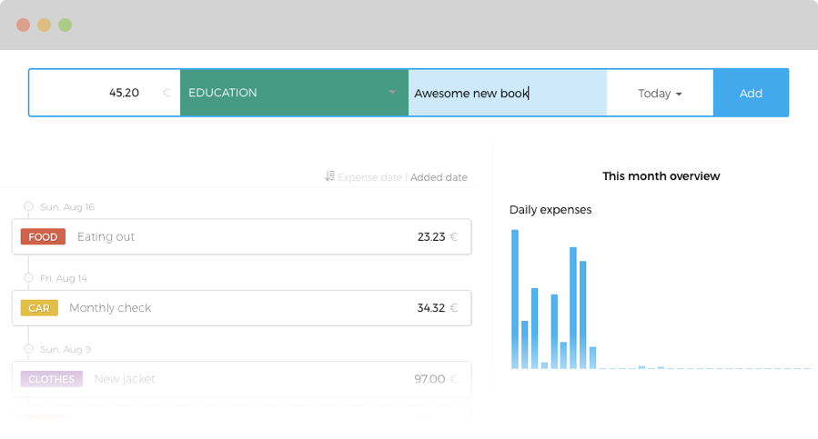
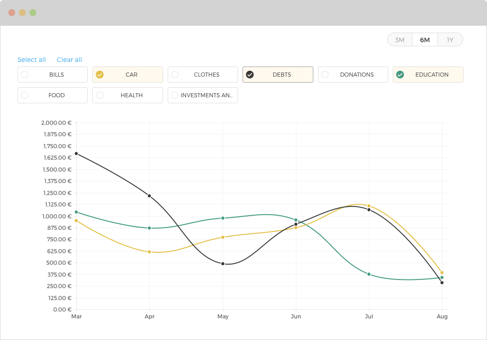
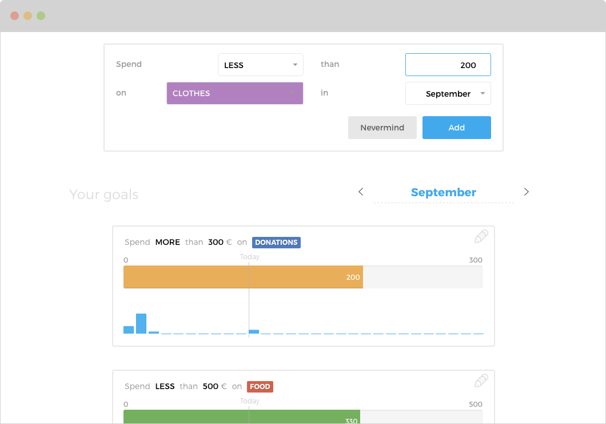
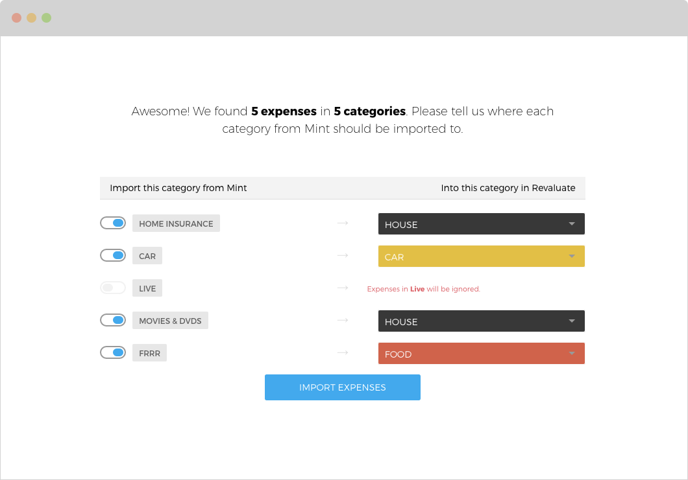
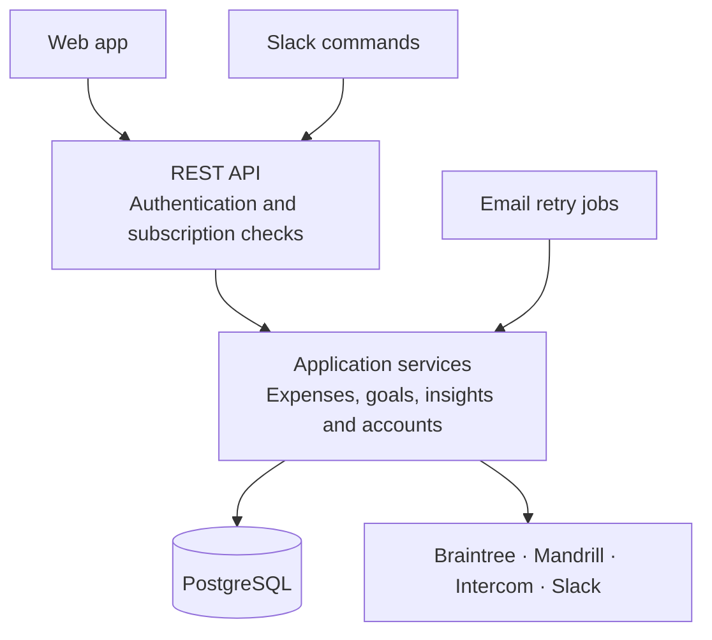

<div align="center">


# Revaluate API

**A personal expense tracker I built in my free time, launched in 2015 and ran in production for over a year.**

[](https://github.com/ioanlucut/revaluate-api/actions/workflows/ci.yml)
[](https://www.producthunt.com/products/revaluate)
[](LICENSE)



</div>

Revaluate helped people see where their money goes. You could log an expense in a few keystrokes, set a goal such as *spend less than 500 € on food this month*, and compare your spending across months and categories.

We launched the beta in June 2015 and were [featured on Product Hunt](https://www.producthunt.com/products/revaluate) that September. This repository contains the backend; the [web app lives here](https://github.com/ioanlucut/revaluate-web).

## My part

Revaluate was a team of two. I built the entire backend and most of the frontend; [Sorin Pantis](https://github.com/sorinpantis) handled product and design.

My work covered the product from end to end: the database and API, account flows, spending insights, imports, payments, emails, third-party integrations and deployment. It was a side project, but it went beyond a prototype: we launched it, shipped updates and kept it running in production.

## What people could do

- **Track spending quickly.** Add expenses, organise them into categories and look back through a daily timeline.

- **Set goals and spot patterns.** Set monthly spending limits, see progress and compare categories over time.

- **Bring their history along.** Import expenses from Mint, Spendee or Trace, mapping the old categories onto their own.

- **Use it from Slack.** Add an expense with `/revaluate add 43 FOOD going out`, or check recent spending without leaving a conversation.

- **Manage an account and subscription.** Sign in with email, Facebook or Google, recover a password, and move from a trial to a paid plan through Braintree.

<table>
<tr>
<td width="33%"></td>
<td width="33%"></td>
<td width="33%"></td>
</tr>
<tr>
<td><sub>Compare spending across months.</sub></td>
<td><sub>Keep track of a monthly goal.</sub></td>
<td><sub>Bring expenses over from another app.</sub></td>
</tr>
</table>

<sub>Screenshots of the original web app, from the Revaluate landing page.</sub>

## What I learned

The biggest learning was the whole lifecycle: taking an idea through implementation, launch and day-to-day operation. Almost every feature brought something new, especially where the backend, the interface and another service had to agree.

**Payments were more than a checkout form.** Trials, payment methods, subscriptions and access restrictions had to work together. A restrictive UI also needed to tell people why an action was unavailable and what they could do next. Implementing both sides made that connection much clearer to me.

**Accounts were more than sign-up and login.** Confirmation emails, password recovery, feedback and delivery retries were all part of the experience. Building these flows taught me how much work sits around the main feature people came to use.

**Third-party integrations were a substantial part of the product.** Braintree, Mandrill, social sign-in and Slack each brought their own APIs, credentials and failure modes. I learned across all of them rather than treating integration as a final wiring step.

**The database and deployment mattered just as much as the code.** Schema changes, migrations, queries, indexes and hosting on Heroku connected feature development with keeping a service running. Owning that whole path was one of the most valuable parts of the project.

## Under the hood

The backend is a Java application built with Dropwizard, Spring, Jersey and Hibernate, backed by PostgreSQL. Flyway manages schema changes. It runs as one application, with Maven modules separating the API, domain logic and integrations.



If you'd like to look at the code, I've written up three examples: [CSV imports, subscription access and spending insights](docs/engineering.md). Each explains the approach, its trade-offs and where to find the implementation and tests.

The [developer guide](docs/development.md) has the module map, API overview, configuration and testing details.

## Try it locally

With Docker installed:

```bash
docker compose up --build
```

The API starts at **http://localhost:8080**. No payment, email or other third-party account is needed.

To try a complete flow, run this in another terminal with Python installed:

```bash
python3 scripts/smoke-test.py
```

It signs up a temporary user, creates an expense, checks that it appears in the spending insights and removes the account afterward. The same walkthrough runs in CI alongside the Java tests.

This is the original application, made runnable again—not a modern production starter. Keep it local and use sample data. See the [developer guide](docs/development.md#run-with-docker) for setup details and cleanup.

## Then and now

Development started in February 2015. We [launched the beta that June](https://github.com/ioanlucut/revaluate-api/releases/tag/1.0.0), added [goals in September](https://github.com/ioanlucut/revaluate-api/releases/tag/1.0.7) and [Slack in October](https://github.com/ioanlucut/revaluate-api/releases/tag/1.0.8). Across 2015–16, the backend grew through **622 commits and 16 releases**.

The later [move from Heroku to EC2](https://github.com/ioanlucut/revaluate-api/tree/archive/ec2-migration-2016) and an unfinished [recurring-reminders prototype](https://github.com/ioanlucut/revaluate-api/tree/archive/reminders-prototype-2015) are preserved on archive branches.

In 2026 I brought the project back into a runnable state: repaired the build, added Docker setup and CI, cleaned up the repository and documented it. The Java suite now has **219 passing tests and four skipped**; a separate smoke test exercises the packaged API against PostgreSQL. The old third-party integrations are preserved, but aren't tested against today's providers.

Looking back, I'd keep the single-application design, but update the dependencies and revisit authentication before putting it online again. I'd also make payment recovery and money/date handling more explicit. The [engineering notes](docs/engineering.md) go into those trade-offs without pretending the original implementation got everything right.

## License

[MIT](LICENSE) © 2015–2026 Ioan Lucuț
