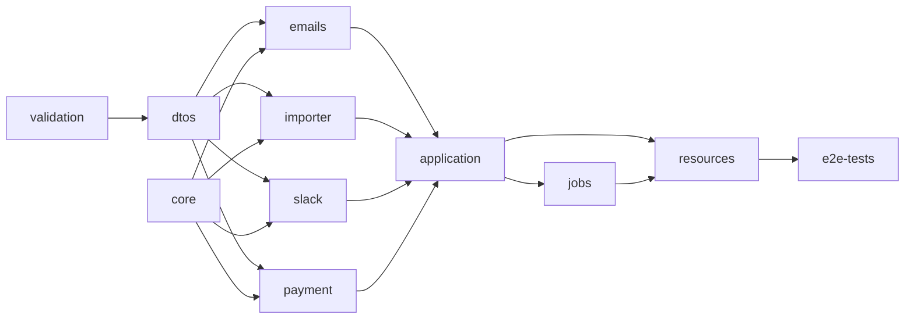
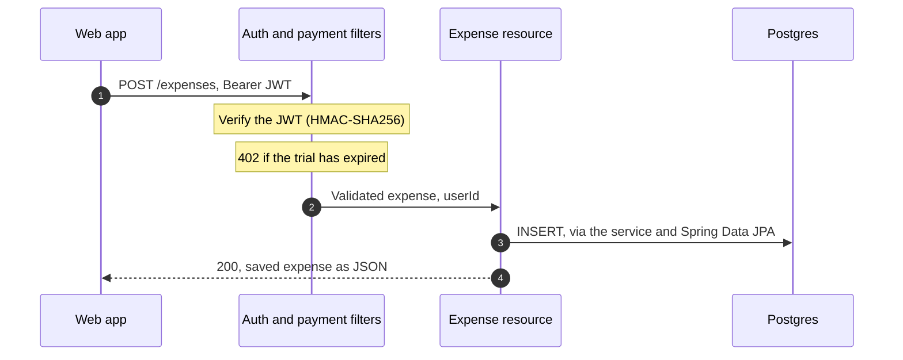

# Running and exploring the API

[Back to the project](../README.md) · [Engineering notes and code tour](engineering.md)

This is the preserved backend of a product built in `2015–16`. The local setup needs no third-party accounts: email sending is skipped and integration keys are empty. Use synthetic data only; the legacy frameworks and database are not a current production template.

## Run with Docker

```bash
docker compose up --build
```

This builds with JDK `8`, starts PostgreSQL, applies Flyway migrations and serves the API at `http://localhost:8080`. The admin port is `8081`; the database port is `5432`. All published ports are bound to loopback.

In another terminal:

```bash
curl --fail http://localhost:8080/
# {"answer":"OK"}

# Requires Python 3, with no extra packages
python3 scripts/smoke-test.py
```

The [smoke test](../scripts/smoke-test.py) creates a unique synthetic account, logs in, creates a category and an expense, retrieves the saved expense and checks the month's spending total. It uses returned IDs rather than assuming an empty database, and deletes its temporary account afterward. A failed check exits nonzero.

```text
PASS: API is ready
PASS: expenses require authentication
PASS: sign-up and login
PASS: category and expense creation, persisted expense retrieval
PASS: monthly insights report one expense totalling 23.50
PASS: temporary account removed
Smoke test passed.
```

Pause the stack with `docker compose stop`. For a clean reset, use `docker compose down --volumes`, which deletes its local database data. The demo uses an anonymous database volume; it is not a persistence or backup setup.

## Build from source

You need JDK `8` and Maven.

```bash
docker compose up -d postgres
mvn install
java -DENVIRONMENT=local -jar resources/target/resources-1.0.jar server resources/src/main/resources/config_local.yaml
```

## Configuration

The `ENVIRONMENT` system property selects `core/src/main/resources/installation_<ENVIRONMENT>.properties`, and the YAML file configures Dropwizard. System properties take precedence over the properties file.

These are the historical integration settings, not a guarantee that the old clients still work with today's providers. Do not commit real credentials.

| Integration | Properties |
| --- | --- |
| JWT | `-Dshared=<long random secret>` and `-Dissuer=<site URL>` |
| Braintree | `-DbraintreeMerchantId`, `-DbraintreePublicKey`, `-DbraintreePrivateKey`, `-DbraintreePlanId`; sandbox unless `isProduction=true` |
| Slack | `-DslackClientId`, `-DslackClientSecret` |
| Mandrill | `-DmandrillAppKey`, `-DskipSendEmail=false` |
| Intercom | `-DintercomAppId`, `-DintercomAppKey` |
| JavaMelody | `-DmonitoringUsers=user:password`; the `/monitoring` console is off without it |
| Database | `-Ddb.url`, `-Ddb.username`, `-Ddb.password` for Spring; `-Ddw.database.url`, `-Ddw.database.user`, `-Ddw.database.password` for Dropwizard and Flyway |

## Modules

The application is one deployable JVM process. Maven modules separate the HTTP layer, domain logic and integration clients; they are not separate services.



| Module | Responsibility |
| --- | --- |
| `validation` | Custom Bean Validation constraints, such as hex colours |
| `dtos` | DTOs, JSON views and validation groups; builders generated by PojoBuilder |
| `core` | Configuration, JWT signing and verification, AOP logging, `@Public` and `@PaymentRequired` |
| `emails` | Mandrill templates for welcome, password reset and feedback emails |
| `importer` | CSV parsing with uniVocity and profiles for Mint, Spendee and Trace |
| `slack` | The contract for answering Slack commands |
| `payment` | The Braintree gateway: customers, payment methods, subscriptions and transactions |
| `application` | JPA entities and repositories, services, insights, Slack OAuth, command parsing, Dozer mappings and Flyway migrations |
| `jobs` | Scheduled retries for failed email sends |
| `resources` | Dropwizard application, Jersey resources, exception mappers, auth and payment filters, CORS |
| `e2e-tests` | Historical HTTP tests; not enabled in the Maven build |

## HTTP API

Authenticated routes require `Authorization: Bearer <JWT>`; resource methods annotated with `@Public` bypass that filter. Login returns the JWT in the `AuthToken` response header. Dropwizard logs the routes on startup.

| Resource | Operations |
| --- | --- |
| `/account` | Sign-up, login, OAuth, details, currency, password, email confirmation, password reset, feedback, deletion |
| `/categories` | CRUD, bulk create and delete, starter set, uniqueness check |
| `/expenses` | CRUD, bulk delete, paged listing, grouping by day, date-range and category queries |
| `/goals` | CRUD, bulk delete, date-range queries, uniqueness per category |
| `/insights` | Monthly, daily, overview, progress, months with data |
| `/statistics` | Months with expenses or goals, per year |
| `/importer` | Analyse and import Mint and Spendee exports; Trace import |
| `/payment` | Client token, subscription, payment status and history, customer and payment-method updates |
| `/oauth` | Grant, list and remove Slack integrations |
| `/slack` | The `/revaluate` slash command |
| `/appconfig`, `/appstats`, `/` | Client configuration, team stats, health |

### An expense request



## Tests and CI

`mvn install` runs the unit tests. `mvn install -PexecITs` also runs integration tests against an in-memory HSQLDB database.

- The Java suite reports `223` tests: `219` passing and `4` skipped. Three skipped tests depend on live Braintree or Intercom APIs.

- The `182` application integration tests exercise services with a Spring context and database, including account flows, categories, goals, insights, imports and Slack command parsing.

- The `16` resource filter tests check authentication and payment restrictions.

CI runs this suite on JDK `8` for pushes to `main` and pull requests. A separate job builds the Docker image, starts the documented Compose stack against PostgreSQL, and runs the HTTP smoke test.

The historical HTTP tests in `e2e-tests` are not enabled. The new smoke test checks one local journey and is not included in the Java test count. Neither check verifies live payments, email delivery, OAuth providers or Slack.

## Revival work

The revival keeps the historical Java application rather than replacing it with a modern implementation:

- Build dependencies now come from Maven Central over HTTPS instead of retired plain-HTTP mirrors.

- Locale-dependent tests no longer assume a particular order from the JDK's locale list. The supported build target remains JDK `8`.

- Docker Compose replaces the old deployment scripts for local exploration, and CI checks the build and local journey.

- Generated sources, IDE files and dead environment configs were removed. The monitoring console requires a configured login.

- Committed credentials and personal data were redacted from repository history. Redaction does not revoke credentials or erase copies elsewhere; previously exposed credentials need rotation before any reuse of the associated services.
